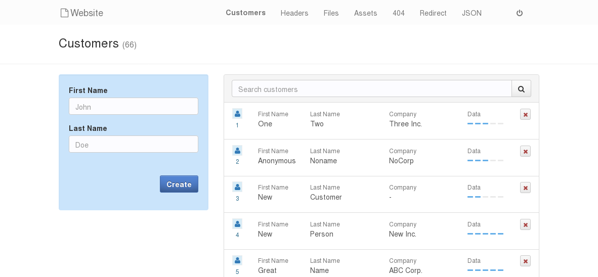
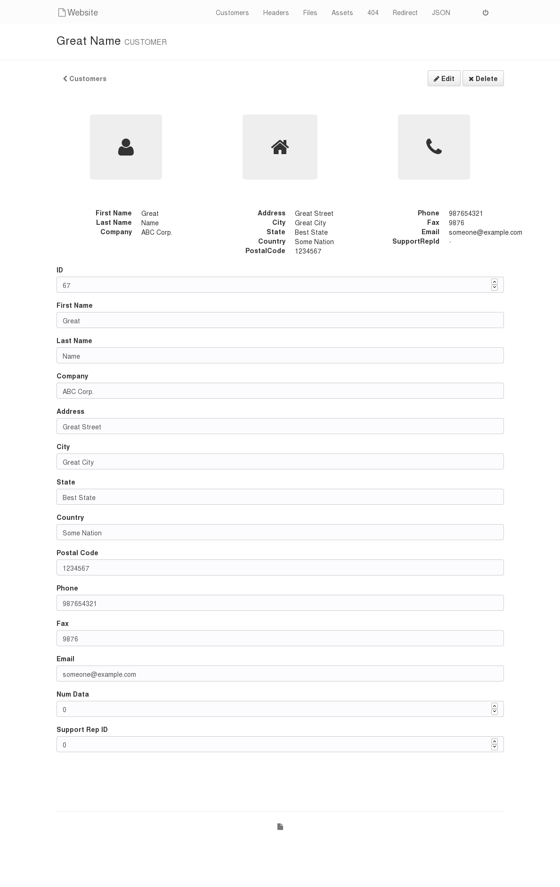
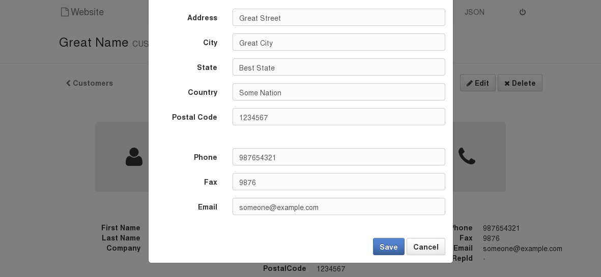
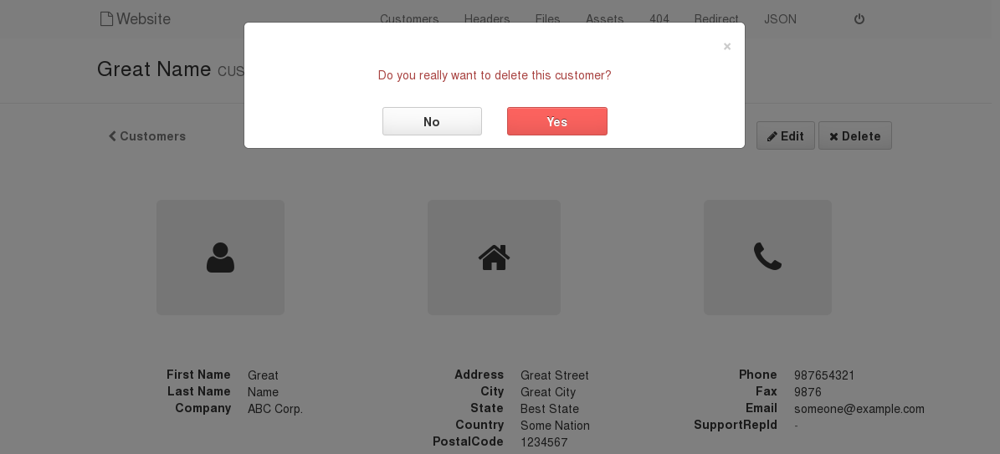
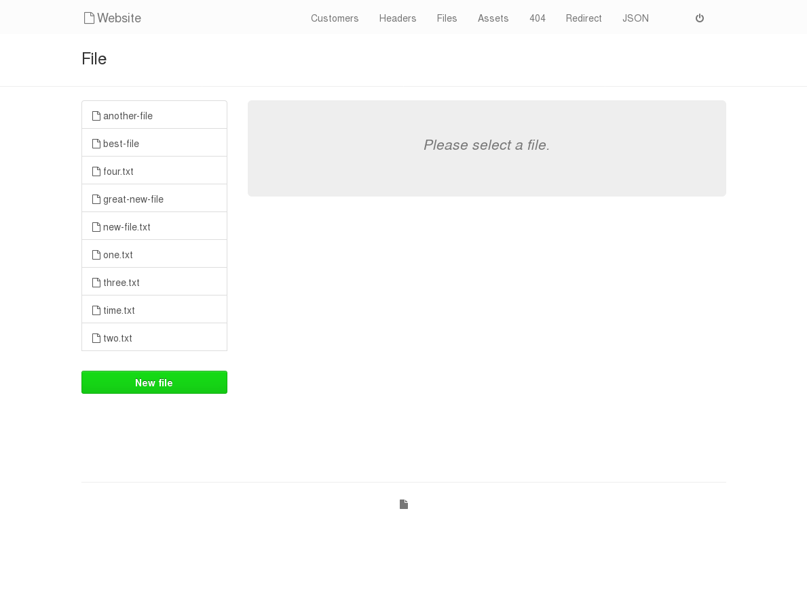
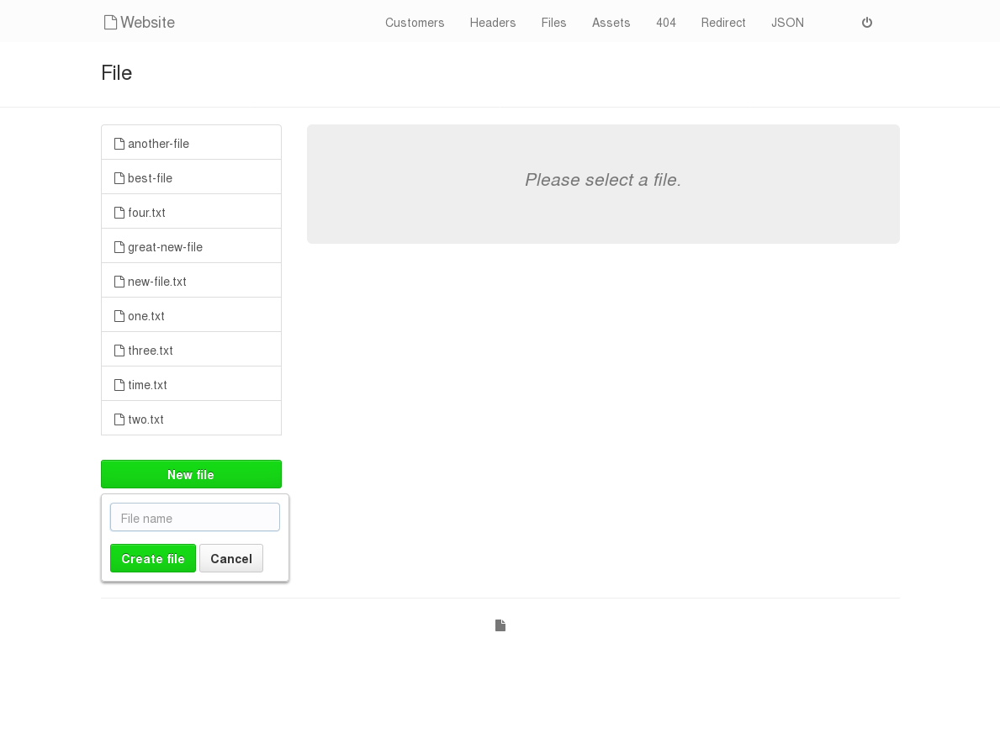
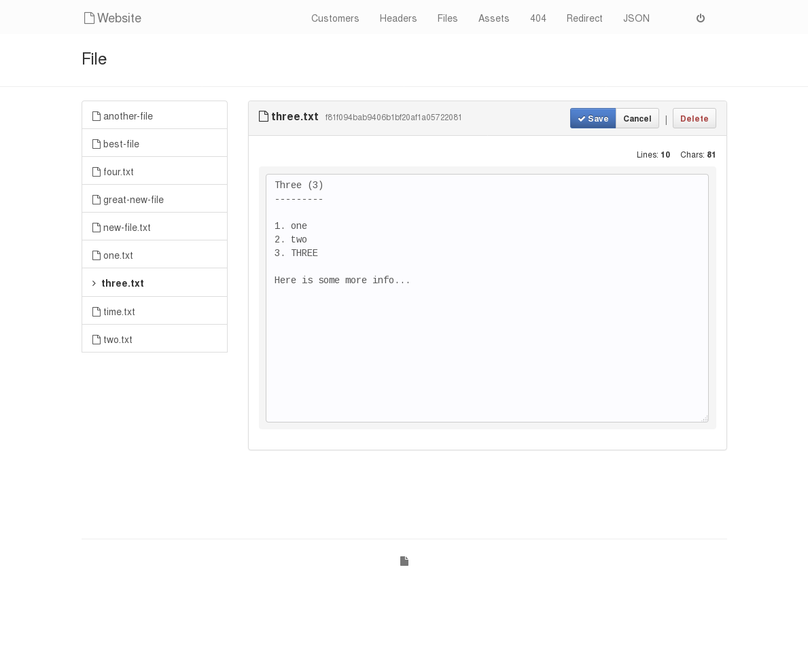
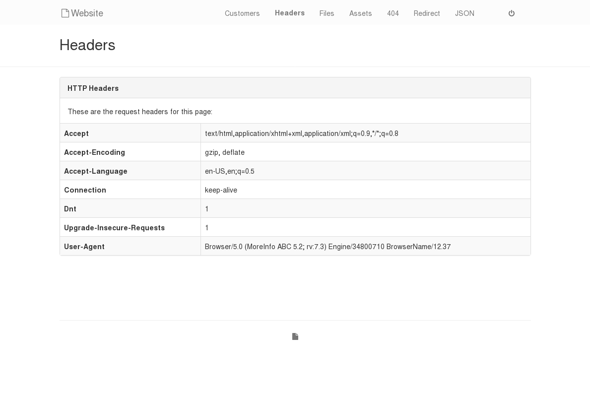

# Go Web App Example

Most of the things are crammed into `main.go` for a quick overview.

## Screenshots

*Some more vanity screenshots can be found [here](Screenshots.md).*

**Customers Page**

**Customer Profile**

**Customer Editing**

**Customer Deletion**

**File Selection**

**File Creation**

**File Editing**

**Headers Page**

